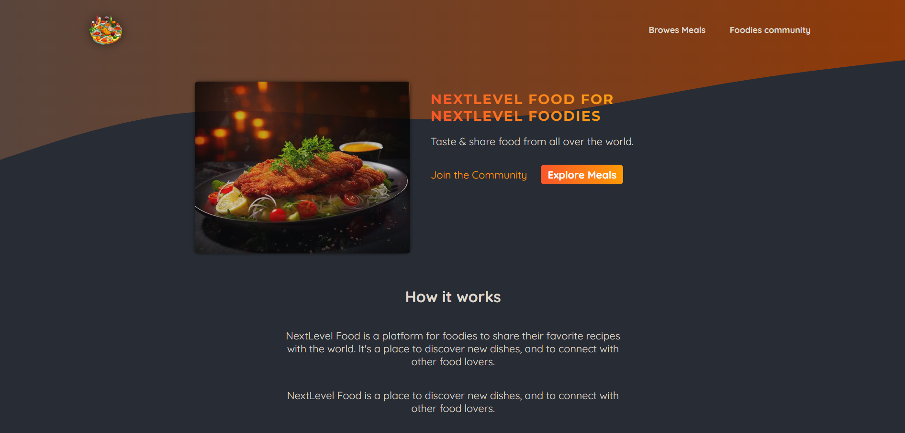
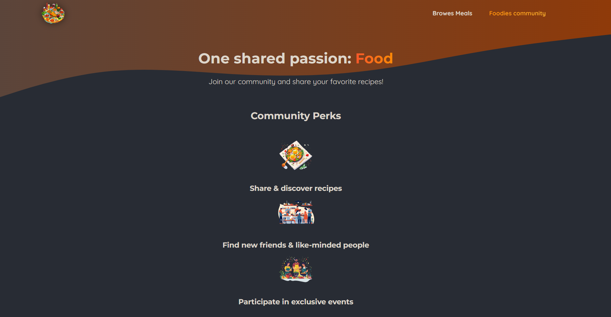
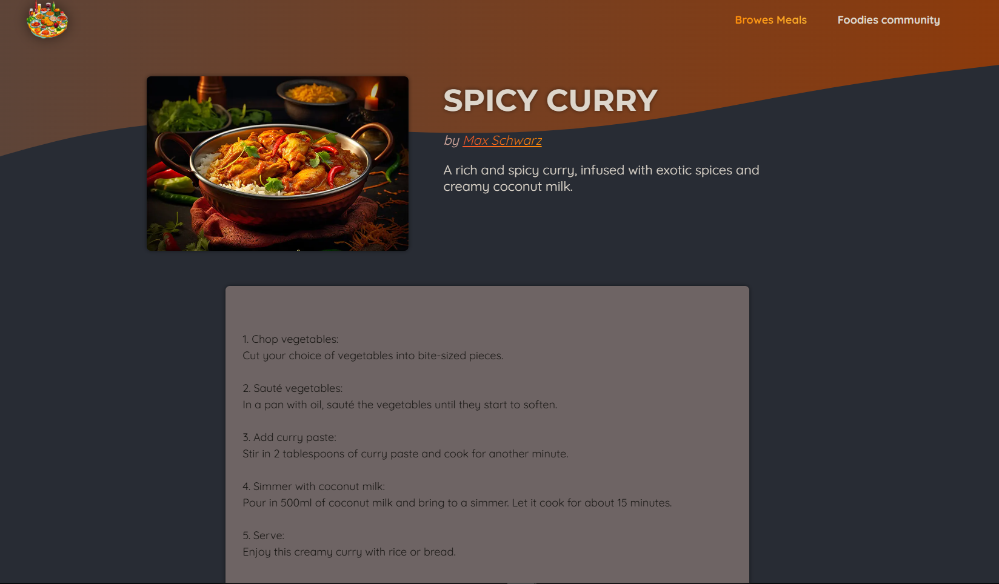
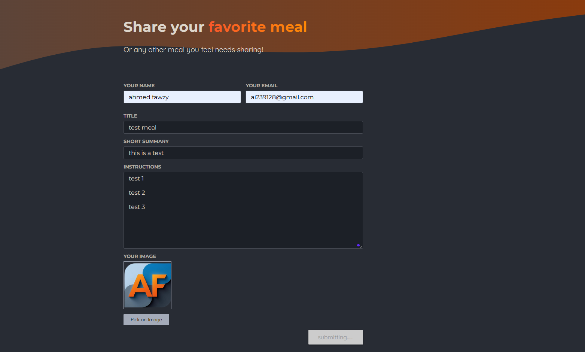

# 🍽️ NextLevel Food

A social platform for food enthusiasts to share recipes, discover new dishes, and connect with a community of passionate food lovers.

---

##  Features

- Create and share recipes with detailed ingredients and steps  
- Explore a wide variety of dishes from other users  
- Clean and user-friendly browsing experience  
- Fully responsive design across all devices  
- Community-driven platform for food lovers  
- Fast and optimized content loading  

---

##  Tech Stack

- Next.js  
- Node.js  
- JavaScript  
- SQLite  
- Tailwind CSS  
- AWS S3  
- HTML5  

---

##  Installation

1. Clone the repository:  
   git clone https://github.com/ahmedibra24/NextLevel-Food.git  

2. Navigate to project folder:  
   cd nextlevel-food  

3. Install dependencies:  
   npm install  

4. Setup environment variables (if required)

5. Run development server:  
   npm run dev  

6. Open in browser:  
   http://localhost:3000  

---

##  Usage

- Create a new recipe with ingredients and steps  
- Browse recipes shared by other users  
- Explore food content in a smooth UI experience  
- Access platform from any device  

---

##  Screenshots

- Home
  

- Community
  

- Meals
![Meals(./screenshots/screen2.png)  

- Recipe details
  

- Create Recipe
  

---

##  Challenges Solved

- Structuring and displaying recipe data clearly  
- Building a smooth content sharing experience  
- Designing a responsive and modern UI  
- Managing scalable user-generated content  
- Handling media storage with AWS S3  

---

##  Future Improvements

- Add user authentication system  
- Like & comment system  
- Recipe rating system  
- Search and filtering improvements  
- Social sharing features  

---